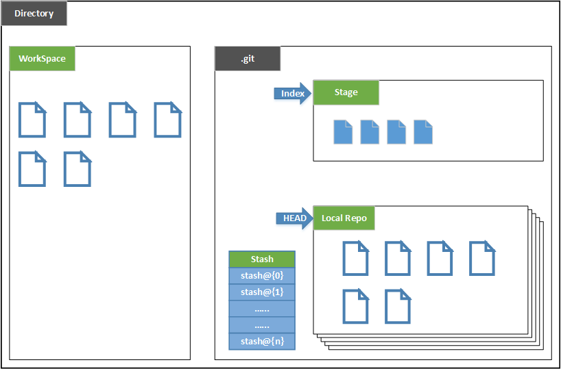
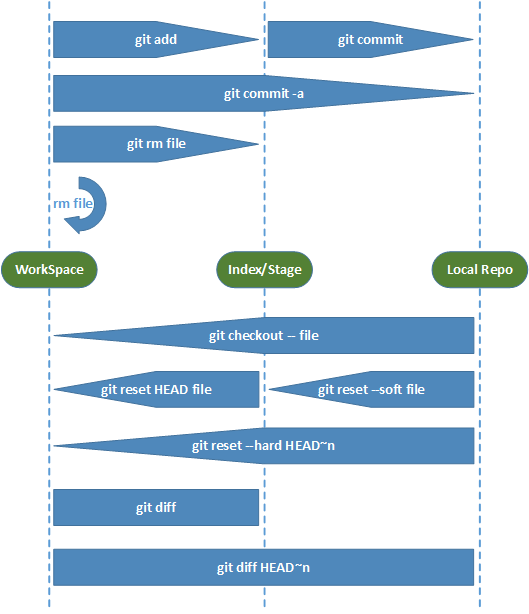

# Git Learn
***
> [原文博客](http://www.cnblogs.com/wilber2013/p/4189920.html)

### Git基本概念 
1. 仓库(repository), 进行版本控制的文件目录
2. git文件夹，保存所有版本信息，更新记录，以及Git进行仓库管理的相关信息

3. 根据上面的图片，下面给出了每个部分的简要说明：
	- Directory：使用Git管理的一个目录，也就是一个仓库，包含我们的工作空间和Git的管理空间
	- WorkSpace：需要通过Git进行版本控制的目录和文件，这些目录和文件组成了工作空间
	- .git：存放Git管理信息的目录，初始化仓库的时候自动创建。
	- Index/Stage：暂存区，或者叫待提交更新区，在提交进入repo之前，我们可以把所有的更新放在暂存区
	- Local Repo：本地仓库，一个存放在本地的版本库；HEAD会只是当前的开发分支（branch）
	- Stash：是一个工作状态保存栈，用于保存/恢复WorkSpace中的临时状态
	- **有了上面概念的了解，下面就开始在本地repo上进行Git操作了**

### 创建仓库
1. `git bash` 命令行窗口进入想要建立版本仓库的目录
2. `git init` 轻松建立一个仓库
3. 创建完成后，自动生成 **.git** 文件件

### 添加文件
1. `git status`查看WorkSpace的状态
2. `git add <file>...`或`git add .`添加文件到暂存区
3. `git commit -m`提交更新，-m 后面是对commit的描述(message)
4. **只有被add到暂存区的更新才会被提交进入repo**
5. **提交前，如果对WorkSpace的文件进行修改，而没有被添加到暂存区，那么提交进入repo中的知识暂存区的更新，WorkSpace修改的部分是不会被提交进入repo中的**

### git diff
1. `git diff`十分常用，用于显示WorkSpace中的文件和暂存区文件的差异
2. `git diff HEAD~n`可以吧WorkSpace中的状态和repo中的状态进行diff

### 撤销更新
1. 更新可能存在三个地方，**WorkSpace Stage repo**
2. 撤销WorkSpace中的更新 `git checkout --<file>...` **(注意：使用这种方法撤销更新时候一定要慎重，因为通过这种方式撤消后，更新将没有办法再找回)**
3. 撤销Stage中的更新 当已经使用`git add`把这个更新提交到了暂存区时， 根据`git status`输出的提示信息，使用 `git reset HEAD <file>...` 把暂存区的更新移出到WorkSpace中
4. 撤销repo中的更新 
	- `git log`查看commit的历史记录 再使用**HEAD**指针和使用**commit id** 
	```
	git reset --hard HEAD^
	git reset --hard HEAD^^
	git reset --hard HEAD~3
	```
	- `git reflog`查看仓库中所有分支的所有更新记录，包括已经撤销的更新
	```
	git reset --hard HEAD@{1}
	git reset --hard f752570
	```
	- **--hard**撤销并删除相应的更新
	- **--soft**撤销相应的更新，把这些更新内容放到Stage中

### 删除文件
1. `git rm` 比 `rm` 只是多了一步，把这次删除的更新提交到Stage中

## 总结

